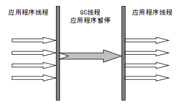
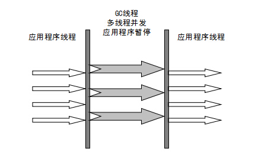
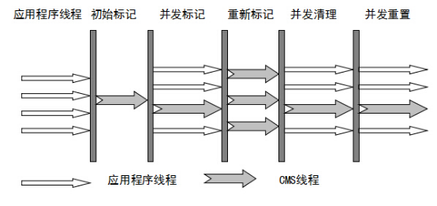

## JVM内存模型


- 程序计数器：一块较小的内存区，存放当前程序执行的字节码指令地址，当前线程执行的是本地方法，计数器为undefined。在多线程情况下，线程切换回来时就知道上次线程执行到什么位置了。线程私有的，不会出现oom
- Java虚拟机栈：描述java方法运行过程的内存模型。每个运行的java方法都会创建一个叫做栈帧的区域，用于存放方法运行过程中的一些信息，如局部变量，操作数栈，动态链接，方法出口信息等。当一个方法中调用新的方法，会创建新的栈帧，压入栈顶，方法执行结束，栈帧被移除。线程私有，会出现两种异常 StackOverflowError 栈深度太大，超过最大值。OOM 内存用完。


- 本地方法栈：与Java虚拟机栈类似，描述本地方法运行的内存模型
- 方法区：Java虚拟机规范中定义是堆的一个逻辑部分。存放已经被虚拟机加载的类信息，常量，静态变量，即时编译器编译后的代码。线程共享，存储的都是长期存在的对象，因此又被称为“永久代”。内存回收率低，主要回收目标是常量池，类型的卸载。允许固定大小，也允许动态扩展，还允许不实现垃圾回收。常量就存在常量池中，当类被Java虚拟机加载后，.class文件中的常量就存放在方法区的运行常量池。而运行期间也能向常量池中添加新的常量。
- 堆：一个Java虚拟机只有一个堆，所有的线程共享，在虚拟机启动时创建，是垃圾回收的主要场所。进一步细分为新生代（Eden区，From survior，To surivor）、老年代。不同区域存放不同的生命周期的对象。堆的大小既可以固定也可以扩展，主流虚拟机堆大小是可以扩展的，可能会出现OOM异常。
- 直接内存（堆外内存）：虚拟机之外的内存，也可使用。在NIO中引入了一种基于通道和缓冲的IO方式，可以直接通过本地方法直接分配本地内存，通过堆中的DirectByteBuffer直接操作内存，无须将外部内存中的数据复制到堆中再进行操作，大大提高了数据操作的效率。大小不受Java虚拟机的控制，也可能出现OOM。与堆内存相比，申请空间耗费更高性能，读取IO由于普通堆内存。

## Hotspot虚拟机（JVM虚拟机标准的一种实现）


- 对象的内存布局分为：对象头，实例数据，对齐填充。
  - 对象头：记录了对象在运行时的一些数据，哈希码，GC分代年龄，锁状态标志，线程持有锁，偏向锁ID，偏向时间戳。对象头可能包含类型指针，通过指针能确定对象属于哪个类。如果对象是一个数组，还会包括数组的头部。
  - 实例数据：成员变量的值，包括父类成员变量和本类成员变量。
  - 对齐填充：确保对象长度为8字节的整数倍。只是HotSpotVM自动内存管理的标准，可以有其它不同标准。
  
- 对象创建的过程

  1. 类加载检查：虚拟机在解析 .class文件时，若遇到一个new指令，首先会去检查常量池中是否有这个类的符号引用，并检查这个符号引用所代表的类是否已经被加载、解析和舒适化过。如果没有则需要执行类加载的过程。
  2. 为新生代对象分配内存：在类加载完成之后对象所需内存已经确定，分配方式有指针碰撞与空闲列表两种。指针碰撞效率高，空闲内存与已使用内存质检放着一个指针，分配的时候只需要挪动指针即可。此内存结构往往是标记整理或者复制算法导致。空闲列表法指的是VM维护一个列表哪块内存区空闲以及大小，分配的时候从空闲列表中找到一个足够大的内存块进行分配。
  3. 分配完内存后为对象中的变量赋上初始值，设置对象的头信息。对象创建过程结束。

- 对象访问方式：建立一个对象时既需要在堆中分配内存又需在栈中分配内存，堆中分配的是对象本身，栈中分配的是对象的引用。引用存放的类型不同，对象有不同的访问方式，句柄访问与直接访问

  - 句柄访问：堆中有一块叫“句柄池”的内存块，包含了实例数据与类型数据各自的具体信息。引用类型变量存放的是改对象的句柄地址。访问对象时限通过引用获取到句柄地址，然后根据句柄中对象地址找到对象。

  

  - 直接访问：引用类型变量直接存放对象的地址，不需要“句柄池”。但是对象所在内存空间需要额外维护存储对象的类信息地址（原本句柄池维护的元信息）。Hotspot采用的是第二种，性能上比句柄快一倍，但是它需要额外的策略来存储对象在方法区中类信息的地址。

  

## JVM垃圾回收算法

> 垃圾回收算法主要针对Java堆与方法区，因为只有在程序运行期间才能知道会创建哪些对象，这部分内存的分配与回收都是动态的。

#### 判断对象是否存活

> 如果一个对象不被任何对象或变量引用，则是无效对象，需要被回收。

- 引用计数法：在对象头维护一个计数器，对象被引用一次则加1，引用失效就减1。当计数器为0时，对象就无效了。实现简单，判断效率高，但是它很难解决对象之间的循环引用问题。因此主流虚拟机都不选此方法。
- 可达性分析：所有和GC Root有直接或者间接关联的对象都是有效对象。而GC Root指的是 Java虚拟机栈/本地方法栈中的引用的对象，方法区中常量和静态属性引用的对象。GC Root 并不包括堆中对象所引用的对象，因此不会有循环引用问题。

#### 引用类型

- 强引用：例如 Object c = new Object() ，这类就是强引用。只要有强引用的存在，垃圾收集器永远不会回收被引用的对象。如果错误的保持强引用，比如赋值给 static 变量，则会产生内存泄露。
- 软引用：比强引用稍弱，只有当JVM内存不足时，才会试图回收软引用对象。软引用通常来实现内存敏感的缓存，内存足，缓存在，内存不足，缓存被清理。
- 弱引用：比软引用更弱。当JVM进行垃圾回收时，无论内存是否充足，都会回收只被弱引用关联的对象。
- 虚引用：最弱的引用。一个对象是否有虚引用的存在，完全不会对其生存时间构成影响。仅仅提供了一种确保对象被finalize以后，做某些事情的机制。比如，通常用来做所谓的Post-Mortem清理机制。

#### 回收无效对象

> 不可达对象也并不是完全没有存活的可能

- 判定finalize() 是否有必要执行：如果对象没有覆盖此方法或者此方法已经被虚拟机调用过，则视为无必要执行。那么对象基本上真的要被回收了。如果对象判断有必要执行此方法，对象会被放入一个F-Queue队列中，虚拟机会以较低的优先级执行这些对象的finalize方法，但是不会保证所有的对象此方法都被执行，如果有的finalize方法出现耗时操作，则直接停止指向该方法，将对象清除。
- 对象重生或死亡：如果在执行finalize方法时，对象被重新引用，那么该对象就重生了，如果没有则会被清除。任何一个对象的finalize方法只会被系统调用一次，如果对象面临下一次回收，它的finalize方法不会被再次被执行，无法在finalize中进行自救。

#### 方法区内存回收

> 方法区中存放生命周期较长的类信息、常量、静态变量，每次垃圾收集器只有少量的垃圾被清除。方法区中清除的垃圾主要有两种：废弃的常量，无用的类。

##### 判断废弃常量

- 只要常量池中的常量不被任何变量或者对象引用，常量就会被清除掉。

##### 判断无用的类

- 该类的所有对象已经被清除
- 加载该类的ClassLoader已经被回收
- 该类的java.lang.Class 对象没有在任何地方被引用，无法在任何地方通过反射访问该类的方法

#### 垃圾回收算法

- 标记-清除算法：遍历所有GC Roots，然后将所有GC Roots可达对象标记为存活对象。然后遍历堆中所有对象，将未标记的对象全部清除，同时将已经被标记的对象上的标记去除。

  - 效率问题：标记和清除两个过程效率都不高。
  - 空间问题：此算法会产生大量的不连续的内存碎片，可能导致以后需要分配大对象而无法找到足够的连续空间，从而不得不提前触发一次垃圾收集动作。

- 复制算法（新生代）：将内存划分为大小相等的两块，每次只使用一块，在垃圾回收时，将使用的那一块上存活的对象全部复制到另一块上面，然后将使用的那一块全部清除。

  - 优点：不会有内存碎片，因为在复制的过程中，会将不连续的内存块复制到新的块上，并保持连续。
  - 缺点：内存缩小到原来的一半

  > 为了解决空间利用率的问题，可以将内存分为3块，Eden，From Survivor，To Survivor，比例一般是8：1：1，每次使用Eden区和其中一块Survivor区。回收时，将Eden和其中一块Survivor区中还存活的对象一次性复制到另一块Survivor区上，最后清理掉Eden区和刚使用的Survivor区。这样做只有10%的内存会被浪费。
  >
  > 但是我们无法保证每次都只有不多余10%的对象存活，当Survivor空间不够时，需要依赖其它内存（老年代）进行分配担保，即触发MinorGC进行垃圾收集。如果MinorGC后还有超过10%的对象存活，这样的对象将直接通过分配担保机制进入老年代，然后将新对象存入Eden区。

- 标记-整理算法：第一阶段和标记清除算法一样，标记存活对象。然后移动所有存活对象，且按照内存地址依次排列，然后将末端内存地址以后的内存全部回收。这是一种老年代垃圾收集算法，老年代对象一般寿命长，因此每次垃圾回收都会有大量存活对象，如果采用复制算法，每次复制大量对象，效率很低。

- 分代回收算法：根据对象的存活周期不同，建内存划分为几块，一般是划分为新生代与老年代，针对各个年代的特点采用适当的回收算法。例如：新生代使用复制算法，老年代使用标记-清除算法，标记整理算法。

## HotSpot垃圾回收器

### 新生代垃圾回收器

- Serial收集器（单线程）：只开启一条GC线程，并且在GC过程中停止一切用户线程（Stop The Word）。客户端所需内存小，不会创建太多对象，因此垃圾回收时间短，即使存在STW，也不会感觉明显卡顿，因此适用于客户端。只是用一条GC线程，避免了线程切换的开销，从而简单高效。



- ParNew（多线程）：Serial的多线程版本，开启多线程GC，在多CPU环境下性能比Serial会有一定程度的提升；单线程切换需要有额外的开销，因此单CPU环境表现反而不如Serial。



- Parallel Scavenge：多线程的新生代垃圾收集器，追求CPU高吞吐量。有时候会适得其反，因为追求高吞吐量，可以通过减少GC执行时间，这样做就会导致每次GC运行时，有许多工作要做，在此期间积累在堆中的对象数量多。单个GC需要花更多的时间来完成，从而导致更高的暂停时间。而考虑到低暂停时间，最好频繁运行GC以便更快速的完成，又降低了吞吐量。
  - Parallel Scavenge 追求CPU吞吐量，能够在较短时间内完成指定的任务，因此适合没有交互的后台计算。吞吐量=运行用户代码时间/(运行用户代码时间+垃圾收集时间)
  - ParNew追求的是降低用户停顿时间，适合交互式应用

### 老年代垃圾回收器

- Serial Old：Serial的老年代版本，都是单线程，都适应于客户端。唯一区别是使用的垃圾回收算法是标记-整理算法，而Serial使用的是复制算法。
- Parallel Old：Parallel Scavenge 的老年代版本，最求CPU高吞吐量。
- CMS（Concurrent Mark Sweep）：以获取最短回收停顿时间为目标的收集器，在垃圾收集时，用户线程与GC线程并发执行，因此用户不会感觉到明显的卡顿。
  1. 初始标记：STW，使用一条线程对所有与GC Roots直接关联的对象进行标记。
  2. 并发标记：与用户线程并行，使用多线程进行可达性分析，标记所有废弃对象，速度很慢。
  3. 重新标记：STW，使用多线程标记刚刚并发标记过程中出现的新废弃对象。
  4. 并发清除：单线程GC与用户线程并行清理刚才标记的对象，此过程非常耗时。



> 并发标记与并发清除过程最耗时，但是可以跟用户线程并行，所以总体来说CMS回收过程是与用户线程并发执行的。缺点是，吞吐量低；无法处理浮动垃圾，导致频繁GC；标记清除算法容易产生内存碎片。对于产生碎片空间的问题，可以通过开启 -XX:+UseCMSCompactAtFullCollection，在每次 Full GC 完成后都会进行一次内存压缩整理，将零散在各处的对象整理到一块。设置参数 -XX:CMSFullGCsBeforeCompaction 告诉 CMS，经过了 N 次 Full GC 之后再进行一次内存整理。

- G1通用垃圾收集器：G1是一款面向服务端的垃圾收集器，它没有新生代与老年代，将堆划分为一块块独立的Region。当要进行垃圾收集时，首先估计每个Region中垃圾的数量，每次都从垃圾回收价值最大的Region开始回收，因此可以获得最大的回收效率。从整体上看，G1是基于“标记-整理”算法实现的收集器，从局部（两个Region之间）上看是基于“复制”算法实现的，这意味着不会产生内存碎片。
  	1. 初始标记：STW，使用一条线程对所有与GC Roots直接关联的对象进行标记。
   	2. 并发标记：使用一条标记线程与用户线程并发执行。此过程可达性分析，速度很慢。
   	3. 最终标记：STW，使用多条标记线程并发执行。
   	4. 筛选回收：回收废弃对象，STW，使用多条筛选回收线程并发执行。

> 一个对象和他内部引用的对象可能不在同一个Region中，垃圾回收不需要完成扫描整个堆内存，因为每个Region都有一个Remembered Set，用于记录区域中所有对象引用的对象所在的区域，在进行可达性分析时，只需要在GC Roots中在加上 Remembered Set 即可防止对整个堆内存进行遍历。

## 内存分配与回收机制

> 对象的内存分配，主要是在堆上，间接牵连到栈，对象主要分配在新生代的Eden区上，少数情况下可能直接分配在老年代，分配规则不固定，取决于当前的垃圾收集器组合以及相关的JVM参数配置。

#### 对象优先分配在Eden区

- 大多数情况下，对象在新生代的Eden区中分配。当Eden区没有足够的空间进行分配时，会触发一次Minor GC。
  - Minor GC：回收新生代（Eden与Survivor），因为Java对象大多都具备朝生夕死的特征，所以Minor GC 非常频繁，一般回收速度也比较快。
  - Major GC / Full GC：回收老年代，出现了Major GC，经常会伴随至少一次的Minor GC，但是并非绝对，Major GC的速度一般会比Minor GC慢10倍以上。JVM规范中，Major GC和Full GC没有正式的定义，一般简单认为 Major GC清理老年代，Full GC清理整个堆内存。

#### 大对象直接进入老年代

> 一个大对象能够存入Eden区的概率比较小，发生分配担保的概率比较大，而分配担保需要涉及大量的复制，就会造成效率低下。虚拟机提供了一个 -XX:PretenureSizeThreshold 参数，令大于这个值的对象直接在老年代分配，这样做的目的就是避免在Eden区及两个Survivor区之间发生大量的内存复制。

#### 长期存活的对象进入老年代

> JVM 给每个对象定义了一个对象年龄计数器。当新生代发生一次Minor GC后，存活下来的对象年龄+1，当年龄超过一定值时，就将超过该值的所有对象转移到老年代中。  -XXMaxTenuringThreshold 参数控制。

#### 动态对象年龄判断

> 如果当前新生代中的Survivor中，相同年龄所有的对象大小总和大于Survivor空间的一半，年龄 >= 该年龄的对象就可以直接进入老年代，无须等到XXMaxTenuringThreshold 中要求的年龄

#### 空间分配担保

> 只要老年代的连续空间大于新生代对象总大小或者历次晋升的平均大小，就会进行Minor GC，否则将进行 Full GC。通过清除老年代中废弃数据来扩大老年代空闲空间，以便给新生代作担保。

#### 可能触发Full GC 的场景

- System.gc 方法的调用。此方法是建议JVM进行Full GC，不是一定，但是在很多情况下它会触发 Full GC，从而增加Full GC的频率。通常情况下我们只需要让虚拟机自己去管理内存即可，可以通过 XX:+ DisableExplicitGC 来禁止调用 System.gc()。
- 老年代空间不足。老年代空间不足会触发Full GC，若进行该操作后空间依然不足，则会抛出如下错误：java.lang.OutOfMemoryError: Java heap space
- 永久代空间不足。JVM规范中运行时数据区的方法区，在Hotspot中称为永久代，存放一些类信息、常量、静态变量等数据，当系统要加载的类，反射的类和调用的方法较多时，永久代可能会被占满，会触发Full GC。如果经过 Full GC 仍然回收不了，那么JVM会抛出如下错误信息：java.lang.OutOfMemoryError: PermGen space
- CMS GC 时出现担保失败。concurrent mode failure 是在执行 CMS GC的过程中同时有对象要放入老年代，因此是老年代空间不足造成的。
- 统计得到的Minor GC 晋升到老年代的平均大小大于老年代的剩余空间。

## JVM 性能调优

> 在高性能硬件上部署程序，目前主要有两种方式，通过64位JDK来使用大内存；使用若干32位虚拟机建立逻辑集群来利用硬件资源。

#### 64位JDK来使用大内存

> 堆内存变大了后，虽然垃圾收集频率减少了，但是每次垃圾回收时间变长了。如果堆内存为14G，那么每次Full GC 将长达数十秒。如果Full GC频繁发生，对于一个网站来说是无法忍受的。对于用户交互性强、对停顿时间敏感的系统，可以给Java虚拟机分配超大堆的前提是有把握把引用程序的Full GC频率控制的足够低，至少要低到不会影响用户使用。

##### 可能面临的问题

- 内存回收导致长时间停顿
- 现阶段，64位JDK性能普遍比32位JDK低。64位指针膨胀，加载数据到内存更费CPU
- 需要保证程序足够稳定，因为如果一旦堆溢出，几乎无法生成堆快照，因为大小几乎10g，即使能生成也几乎无法分析
- 相同程序在64位JDK消耗的内存一般比在32位JDK的大，这是由于指针膨胀，以及数据类型对齐补白等因素导致的

#### 使用32位JVM建立逻辑集群

> 在一台物理机器上启动多个应用服务进程，每个服务器进程分配不同的端口号，前端以反向代理方式来分配访问请求

##### 可能遇到的问题

- 尽量避免节点竞争全局资源，如磁盘竞争，各个节点如果同时访问某个磁盘文件，很可能IO异常
- 很难高效利用资源池，如连接池，每个节点都是建立自己独立的连接池
- 各个节点收到32位内存限制
- 大量使用本地缓存的应用，在逻辑集群中会造成很大的内存浪费，可考虑把本地缓存改为集中式缓存

#### 调优案例分析

场景描述：一个小型系统使用32位JDK，4G内存，测试期间发现服务端不定时抛出内存溢出异常。加入 -XX:+HeapDumpOnOutOfMemoryError （添加此参数，在堆内存溢出时会输入异常日志），但再次发生内存溢出时，没有生成相关异常日志。

分析： 在32位JDK上，1.6G分配给堆，还有一部分分配给JVM的其它内存，直接内存最大也只能剩余0.4G空间中的一部分，如果使用了NIO，JVM在直接内存分配内存空间，那么就要小心直接内存不足发生内存溢出异常。堆外内存溢出

#### 直接内存回收过程

直接内存虽然不是JVM内存空间，但是它的垃圾回收也是由JVM负责。

垃圾收集进行时，虚拟机虽然会对直接内存进行回收，但是直接内存却不能像新生代，老年代那样，发现空间不足就通知收集器进行垃圾回收，它只能等老年代满了后Full GC，然后“顺便”帮它清理掉内存的废弃对象。

## 类文件结构

#### JVM 的 “无关性”

- 平台无关性：任何操作系统都能运行Java代码
- 语言无关性：JVM能运行处Java以外的其它代码

Java源代码首先要编译成.class 文件，然后又JVM执行.class文件，从而程序开始运行。

而JVM只认识.class 文件，它不关心是何种语言生成了.class 文件，只要.class文件符合JVM规范就能运行。目前已经有JRuby，Jython，Scala 等语言能够在JVM上运行。它们各自有自己的语法规则，但是编译器都能将各自的源码编译成符合JVM规范的.class 文件，从而能借助JVM运行。

> Java语言中的各种变量、关键词和运算符号的语义最终都是由多条字节码命令组合而成，因此字节码命令所能提供的语义描述肯定比Java语言本身更加强大。因此有一些Java语言本身无法有效支持的语言特性不代表字节码本身无法有效支持

## 类加载的时机

#### 类的生命周期

> 类从被加载到虚拟机内存开始，到卸载为止，整个生命周期包含七个阶段。其中验证、准备、解析三个阶段统称为连接。加载、验证、准备、初始化和卸载这5个阶段的顺序是确定的，类的加载过程必须按照这种顺序开始，解析阶段则不一定：它在某些情况下可以在初始化之后开始，这是为了支持Java语言的运行时绑定。

- 加载
- 验证
- 准备
- 解析
- 初始化
- 使用
- 卸载


#### 类加载过程的“初始化”开始时机

> Java虚拟机规范没有强制约束类加载过程的第一阶段，即加载什么时候开始，但是对于初始化阶段有着严格的规定。有且仅有5种情况必须立即对类进行“初始化”

- 在遇到 new，putstatic，getstatic，invokestatic字节码指令时，如果类尚未被初始化，则需要先触发初始化
- 对类进行反射调用时，如果类还没有初始化，则需要先触发初始化
- 初始化一个类时，如果父类还没初始化，则需先初始化父类
- 虚拟机启动时，用于需要指定一个包含main()方法的主类，虚拟机会先初始化这个主类
- 当使用JDK1.7动态语言支持时，如果一个 java.lang.invoke.MethodHandle 实例最后解析的结果为 REF_getStatic，REF_putStatic，REF_invokeStatic的方法句柄，并且这个方法句柄所对应的类还没被初始化，则需要先触发初始化

#### 接口加载过程

> 接口加载过程与类加载过程稍有不同。当一个类在初始化时，要求其父类全部都已经初始化过了，但是一个接口在初始化时，并不要求其父类接口全部都完成了初始化，当真正调用到父接口的时候才会初始化。

## 类加载过程

> 类加载的过程分为五个阶段：加载，验证，准备，解析和初始化

#### 加载

- 通过类全限定名获取该类的二进制流
- 将二进制流所代表的静态结构转化为方法区运行时数据结构
- 在内存中创建一个代表该类的 java.lang.Class 对象，所为方法区这个类的各种数据的访问入口

##### 获取二进制流

对于Class文件，虚拟机没有明确指明要从哪里获取，怎么获取。除了直接从编译好的.class文件中读取，还有以下几种方式

- 从zip包中读取，如jar，war等
- 从网络中读取，如applet
- 通过动态代理技术生产代理类的二进制字节流
- 由jsp文件生成对应的Class类
- 从数据库读取，如有些中间件服务器可以选择把程序安装到数据库中来完成程序代码在集群间的分发。

##### 非数组和数组加载的比较

- 非数组类加载阶段可以使用系统提供的引导类加载器，也可以由用户自定义的类加载器完成，开发人员可以通过定义自己的类加载器控制字节流的获取方式（重写一个loadClass方法）
- 数组类本身不通过类加载器创建，它是由Java虚拟机直接创建的，再由类加载器创建数组中的元素

##### 注意事项

- 虚拟机规范未规定Class对象的存储位置，对于Hotspot虚拟机而言，Class对象比较特殊，它虽然是对象，但是存放在方法区中
- 加载阶段与连接阶段的部分内容交叉进行，加载阶段尚未完成，连接阶段可能已经开始。单着两个阶段的开始时间任然保持着固定的先后顺序

#### 验证

> 验证阶段保证Class文件的字节流中包含的信息符合当前虚拟机的要求，并且不会危害虚拟机自身安全。验证过程如下

- 文件格式验证。是否符合Class文件格式的规范，并且能被当前版本的虚拟机处理。验证点如下
  - 是否以魔数0XCAFEBABE开头
  - 主次版本号是否在当前虚拟机处理范围之内
  - 常量池是否有不被支持的常量类型
  - 指向常量的索引值是否指向了不存在的常量
  - CONSTANT_Utf8_info 型的常量是否有不符合 UTF8编码的数据
- 元数据验证。对字节码描述信息进行语义分析，确保其符合Java语法规范
- 字节码验证。最为复杂的验证过程，对方法体进行语义分析，保证方法在运行时不会出现危害虚拟机的事件
- 符号引用验证。发生在解析阶段，确保解析正常进行

#### 准备

准备阶段是正式为类变量（静态成员变量）分配内存并设置初始值的阶段。这些变量所使用的内存都在方法区中进行分配。初始值通常情况是数据类型的零（0，null ...），假设

`public static int value = 132;`

那么在准备阶段过后初始值是 0 而不是132 ，因为此时还未执行任何Java方法。存在特殊情况 ，类字段的字段属性表中存在 ConstantValue 属性，那在准备阶段 value 就会被初始化为 ConstantValue 属性所指的值 例如

`public static final int value = 132;`

那么在准备阶段虚拟机会根据ConstantValue 的设置将value 复制为 132

#### 解析

此阶段虚拟机将常量池内的符号引用替换为直接引用的过程

#### 初始化

类加载过程的最后一步，是执行类构造器<clint>() 方法的过程。 此方法是由编译器自动收集类中的所有变量的赋值动作和静态语句块中的语句合并生成的，编译器收集的顺序是由语句在源文件中出现的顺序所决定的。

- 静态语句块中只能访问定义在静态语句块之前的变量，定义在它之后的变量，可以在前面的静态语句块中可以赋值，但不能访问。

```java
public class Test {
    static {
        i = 0;  // 给变量赋值可以正常编译通过
        System.out.println(i);  // 这句编译器会提示“非法向前引用”
    }
    static int i = 1;
}
```

- <clint>() 方法不需要显示调用父类构造器，虚拟机会保证在子类的此方法执行前先执行父类的初始化，意味着父类中定义的静态语句块要优先于子类的变量赋值操作
- <clint>() 方法不是必须的。如果一个类没有静态语句块，也没有对类变量的赋值操作，那么编译器可以不为这个类生成 <clint>() 方法。接口中不能使用静态代码块，但接口也需要通过此方法为静态成员变量显示初始化。接口与类不同，接口的<clint>() 方法 不需要先执行父类的<clint>() 方法，只有当父类接口中定义的变量使用时，父接口才会初始化
- 虚拟机会保证一个类的<clint>() 方法在多线程环境下被正确的加锁，同步。如果多个线程同时去初始化一个类，那么只会有一个线程执行这个类的<clint>() 方法