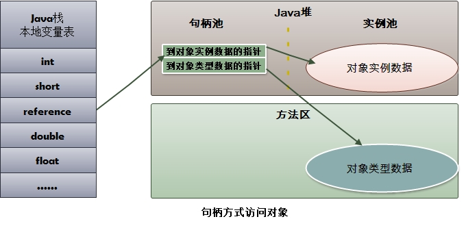

## JVM内存模型

- 程序计数器：一块较小的内存区，存放当前程序执行的字节码指令地址，当前线程执行的是本地方法，计数器为undefined。在多线程情况下，线程切换回来时就知道上次线程执行到什么位置了。线程私有的，不会出现oom
- Java虚拟机栈：描述java方法运行过程的内存模型。每个运行的java方法都会创建一个叫做栈帧的区域，用于存放方法运行过程中的一些信息，如局部变量，操作数栈，动态链接，方法出口信息等。当一个方法中调用新的方法，会创建新的栈帧，压入栈顶，方法执行结束，栈帧被移除。线程私有，会出现两种异常 StackOverflowError 栈深度太大，超过最大值。OOM 内存用完。

- 本地方法栈：与Java虚拟机栈类似，描述本地方法运行的内存模型
- 方法区：Java虚拟机规范中定义是堆的一个逻辑部分。存放已经被虚拟机加载的类信息，常量，静态变量，即时编译器编译后的代码。线程共享，存储的都是长期存在的对象，因此又被称为“永久代”。内存回收率低，主要回收目标是常量池，类型的卸载。允许固定大小，也允许动态扩展，还允许不实现垃圾回收。常量就存在常量池中，当类被Java虚拟机加载后，.class文件中的常量就存放在方法区的运行常量池。而运行期间也能向常量池中添加新的常量。
- 堆：一个Java虚拟机只有一个堆，所有的线程共享，在虚拟机启动时创建，是垃圾回收的主要场所。进一步细分为新生代（Eden区，From survior，To surivor）、老年代。不同区域存放不同的生命周期的对象。堆的大小既可以固定也可以扩展，主流虚拟机堆大小是可以扩展的，可能会出现OOM异常。
- 直接内存（堆外内存）：虚拟机之外的内存，也可使用。在NIO中引入了一种基于通道和缓冲的IO方式，可以直接通过本地方法直接分配本地内存，通过堆中的DirectByteBuffer直接操作内存，无须将外部内存中的数据复制到堆中再进行操作，大大提高了数据操作的效率。大小不受Java虚拟机的控制，也可能出现OOM。与堆内存相比，申请空间耗费更高性能，读取IO由于普通堆内存。

## Hotspot虚拟机（JVM虚拟机标准的一种实现）

- 对象的内存布局分为：对象头，实例数据，对齐填充。
  - 对象头：记录了对象在运行时的一些数据，哈希码，GC分代年龄，锁状态标志，线程持有锁，偏向锁ID，偏向时间戳。对象头可能包含类型指针，通过指针能确定对象属于哪个类。如果对象是一个数组，还会包括数组的头部。
  - 实例数据：成员变量的值，包括父类成员变量和本类成员变量。
  - 对齐填充：确保对象长度为8字节的整数倍。只是HotSpotVM自动内存管理的标准，可以有其它不同标准。
  
- 对象创建的过程

  1. 类加载检查：虚拟机在解析 .class文件时，若遇到一个new指令，首先会去检查常量池中是否有这个类的符号引用，并检查这个符号引用所代表的类是否已经被加载、解析和舒适化过。如果没有则需要执行类加载的过程。
  2. 为新生代对象分配内存：在类加载完成之后对象所需内存已经确定，分配方式有指针碰撞与空闲列表两种。指针碰撞效率高，空闲内存与已使用内存质检放着一个指针，分配的时候只需要挪动指针即可。此内存结构往往是标记整理或者复制算法导致。空闲列表法指的是VM维护一个列表哪块内存区空闲以及大小，分配的时候从空闲列表中找到一个足够大的内存块进行分配。
  3. 分配完内存后为对象中的变量赋上初始值，设置对象的头信息。对象创建过程结束。

- 对象访问方式：建立一个对象时既需要在堆中分配内存又需在栈中分配内存，堆中分配的是对象本身，栈中分配的是对象的引用。引用存放的类型不同，对象有不同的访问方式，句柄访问与直接访问

  - 句柄访问：堆中有一块叫“句柄池”的内存块，包含了实例数据与类型数据各自的具体信息。引用类型变量存放的是改对象的句柄地址。访问对象时限通过引用获取到句柄地址，然后根据句柄中对象地址找到对象。

  

  - 直接访问：引用类型变量直接存放对象的地址，不需要“句柄池”。但是对象所在内存空间需要额外维护存储对象的类信息地址（原本句柄池维护的元信息）。Hotspot采用的是第二种，性能上比句柄快一倍，但是它需要额外的策略来存储对象在方法区中类信息的地址。(./image/.png)

  