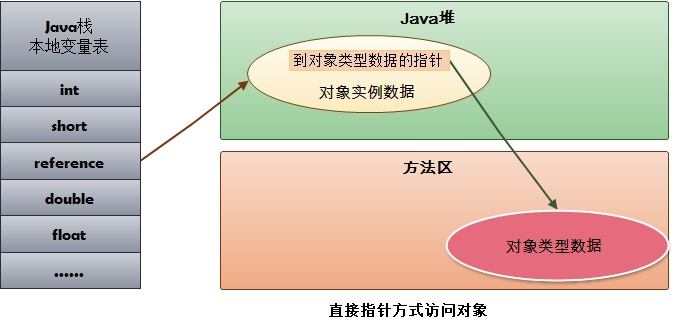

## JVM内存模型

- 程序计数器：一块较小的内存区，存放当前程序执行的字节码指令地址，当前线程执行的是本地方法，计数器为undefined。在多线程情况下，线程切换回来时就知道上次线程执行到什么位置了。线程私有的，不会出现oom
- Java虚拟机栈：描述java方法运行过程的内存模型。每个运行的java方法都会创建一个叫做栈帧的区域，用于存放方法运行过程中的一些信息，如局部变量，操作数栈，动态链接，方法出口信息等。当一个方法中调用新的方法，会创建新的栈帧，压入栈顶，方法执行结束，栈帧被移除。线程私有，会出现两种异常 StackOverflowError 栈深度太大，超过最大值。OOM 内存用完。

- 本地方法栈：与Java虚拟机栈类似，描述本地方法运行的内存模型
- 方法区：Java虚拟机规范中定义是堆的一个逻辑部分。存放已经被虚拟机加载的类信息，常量，静态变量，即时编译器编译后的代码。线程共享，存储的都是长期存在的对象，因此又被称为“永久代”。内存回收率低，主要回收目标是常量池，类型的卸载。允许固定大小，也允许动态扩展，还允许不实现垃圾回收。常量就存在常量池中，当类被Java虚拟机加载后，.class文件中的常量就存放在方法区的运行常量池。而运行期间也能向常量池中添加新的常量。
- 堆：一个Java虚拟机只有一个堆，所有的线程共享，在虚拟机启动时创建，是垃圾回收的主要场所。进一步细分为新生代（Eden区，From survior，To surivor）、老年代。不同区域存放不同的生命周期的对象。堆的大小既可以固定也可以扩展，主流虚拟机堆大小是可以扩展的，可能会出现OOM异常。
- 直接内存（堆外内存）：虚拟机之外的内存，也可使用。在NIO中引入了一种基于通道和缓冲的IO方式，可以直接通过本地方法直接分配本地内存，通过堆中的DirectByteBuffer直接操作内存，无须将外部内存中的数据复制到堆中再进行操作，大大提高了数据操作的效率。大小不受Java虚拟机的控制，也可能出现OOM。与堆内存相比，申请空间耗费更高性能，读取IO由于普通堆内存。

## Hotspot虚拟机（JVM虚拟机标准的一种实现）

- 对象的内存布局分为：对象头，实例数据，对齐填充。
  - 对象头：记录了对象在运行时的一些数据，哈希码，GC分代年龄，锁状态标志，线程持有锁，偏向锁ID，偏向时间戳。对象头可能包含类型指针，通过指针能确定对象属于哪个类。如果对象是一个数组，还会包括数组的头部。
  - 实例数据：成员变量的值，包括父类成员变量和本类成员变量。
  - 对齐填充：确保对象长度为8字节的整数倍。只是HotSpotVM自动内存管理的标准，可以有其它不同标准。
  
- 对象创建的过程

  1. 类加载检查：虚拟机在解析 .class文件时，若遇到一个new指令，首先会去检查常量池中是否有这个类的符号引用，并检查这个符号引用所代表的类是否已经被加载、解析和舒适化过。如果没有则需要执行类加载的过程。
  2. 为新生代对象分配内存：在类加载完成之后对象所需内存已经确定，分配方式有指针碰撞与空闲列表两种。指针碰撞效率高，空闲内存与已使用内存质检放着一个指针，分配的时候只需要挪动指针即可。此内存结构往往是标记整理或者复制算法导致。空闲列表法指的是VM维护一个列表哪块内存区空闲以及大小，分配的时候从空闲列表中找到一个足够大的内存块进行分配。
  3. 分配完内存后为对象中的变量赋上初始值，设置对象的头信息。对象创建过程结束。

- 对象访问方式：建立一个对象时既需要在堆中分配内存又需在栈中分配内存，堆中分配的是对象本身，栈中分配的是对象的引用。引用存放的类型不同，对象有不同的访问方式，句柄访问与直接访问

  - 句柄访问：堆中有一块叫“句柄池”的内存块，包含了实例数据与类型数据各自的具体信息。引用类型变量存放的是改对象的句柄地址。访问对象时限通过引用获取到句柄地址，然后根据句柄中对象地址找到对象。

  

  - 直接访问：引用类型变量直接存放对象的地址，不需要“句柄池”。但是对象所在内存空间需要额外维护存储对象的类信息地址（原本句柄池维护的元信息）。Hotspot采用的是第二种，性能上比句柄快一倍，但是它需要额外的策略来存储对象在方法区中类信息的地址。

  

## JVM垃圾回收算法

> 垃圾回收算法主要针对Java堆与方法区，因为只有在程序运行期间才能知道会创建哪些对象，这部分内存的分配与回收都是动态的。

#### 判断对象是否存活

> 如果一个对象不被任何对象或变量引用，则是无效对象，需要被回收。

- 引用计数法：在对象头维护一个计数器，对象被引用一次则加1，引用失效就减1。当计数器为0时，对象就无效了。实现简单，判断效率高，但是它很难解决对象之间的循环引用问题。因此主流虚拟机都不选此方法。
- 可达性分析：所有和GC Root有直接或者间接关联的对象都是有效对象。而GC Root指的是 Java虚拟机栈/本地方法栈中的引用的对象，方法区中常量和静态属性引用的对象。GC Root 并不包括堆中对象所引用的对象，因此不会有循环引用问题。

#### 引用类型

- 强引用：例如 Object c = new Object() ，这类就是强引用。只要有强引用的存在，垃圾收集器永远不会回收被引用的对象。如果错误的保持强引用，比如赋值给 static 变量，则会产生内存泄露。
- 软引用：比强引用稍弱，只有当JVM内存不足时，才会试图回收软引用对象。软引用通常来实现内存敏感的缓存，内存足，缓存在，内存不足，缓存被清理。
- 弱引用：比软引用更弱。当JVM进行垃圾回收时，无论内存是否充足，都会回收只被弱引用关联的对象。
- 虚引用：最弱的引用。一个对象是否有虚引用的存在，完全不会对其生存时间构成影响。仅仅提供了一种确保对象被finalize以后，做某些事情的机制。比如，通常用来做所谓的Post-Mortem清理机制。

#### 回收无效对象

> 不可达对象也并不是完全没有存活的可能

- 判定finalize() 是否有必要执行：如果对象没有覆盖此方法或者此方法已经被虚拟机调用过，则视为无必要执行。那么对象基本上真的要被回收了。如果对象判断有必要执行此方法，对象会被放入一个F-Queue队列中，虚拟机会以较低的优先级执行这些对象的finalize方法，但是不会保证所有的对象此方法都被执行，如果有的finalize方法出现耗时操作，则直接停止指向该方法，将对象清除。
- 对象重生或死亡：如果在执行finalize方法时，对象被重新引用，那么该对象就重生了，如果没有则会被清除。任何一个对象的finalize方法只会被系统调用一次，如果对象面临下一次回收，它的finalize方法不会被再次被执行，无法在finalize中进行自救。

#### 方法区内存回收

> 方法区中存放生命周期较长的类信息、常量、静态变量，每次垃圾收集器只有少量的垃圾被清除。方法区中清除的垃圾主要有两种：废弃的常量，无用的类。

##### 判断废弃常量

- 只要常量池中的常量不被任何变量或者对象引用，常量就会被清除掉。

##### 判断无用的类

- 该类的所有对象已经被清除
- 加载该类的ClassLoader已经被回收
- 该类的java.lang.Class 对象没有在任何地方被引用，无法在任何地方通过反射访问该类的方法

#### 垃圾回收算法

- 标记-清除算法：遍历所有GC Roots，然后将所有GC Roots可达对象标记为存活对象。然后遍历堆中所有对象，将未标记的对象全部清除，同时将已经被标记的对象上的标记去除。

  - 效率问题：标记和清除两个过程效率都不高。
  - 空间问题：此算法会产生大量的不连续的内存碎片，可能导致以后需要分配大对象而无法找到足够的连续空间，从而不得不提前触发一次垃圾收集动作。

- 复制算法（新生代）：将内存划分为大小相等的两块，每次只使用一块，在垃圾回收时，将使用的那一块上存活的对象全部复制到另一块上面，然后将使用的那一块全部清除。

  - 优点：不会有内存碎片，因为在复制的过程中，会将不连续的内存块复制到新的块上，并保持连续。
  - 缺点：内存缩小到原来的一半

  > 为了解决空间利用率的问题，可以将内存分为3块，Eden，From Survivor，To Survivor，比例一般是8：1：1，每次使用Eden区和其中一块Survivor区。回收时，将Eden和其中一块Survivor区中还存活的对象一次性复制到另一块Survivor区上，最后清理掉Eden区和刚使用的Survivor区。这样做只有10%的内存会被浪费。
  >
  > 但是我们无法保证每次都只有不多余10%的对象存活，当Survivor空间不够时，需要依赖其它内存（老年代）进行分配担保，即触发MinorGC进行垃圾收集。如果MinorGC后还有超过10%的对象存活，这样的对象将直接通过分配担保机制进入老年代，然后将新对象存入Eden区。

- 标记-整理算法：第一阶段和标记清除算法一样，标记存活对象。然后移动所有存活对象，且按照内存地址依次排列，然后将末端内存地址以后的内存全部回收。这是一种老年代垃圾收集算法，老年代对象一般寿命长，因此每次垃圾回收都会有大量存活对象，如果采用复制算法，每次复制大量对象，效率很低。

- 分代回收算法：根据对象的存活周期不同，建内存划分为几块，一般是划分为新生代与老年代，针对各个年代的特点采用适当的回收算法。例如：新生代使用复制算法，老年代使用标记-清除算法，标记整理算法。