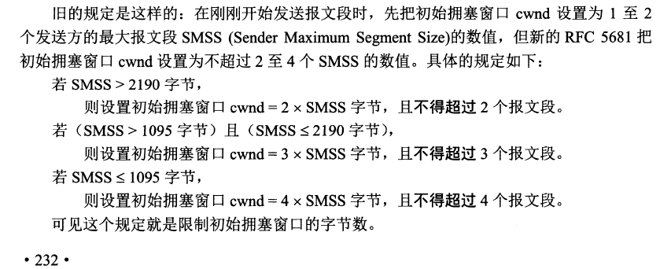
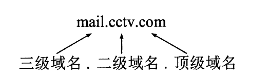
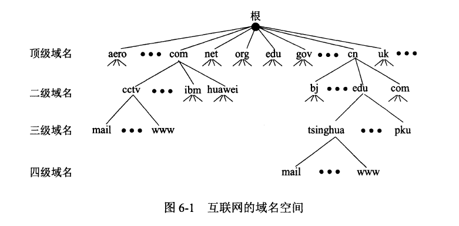

## **物理层**

考虑如何在各种连接上传输比特流，其作用就是要尽可能的屏蔽掉这些传输媒体和通信手段的差异，使物理层之上的数据链路层感觉不到这些差异。

## **数据链路层**

主要类型，点对点通信，广播信道。将网络层交下来的数据报文封装成帧发送到链路上，以及把接收到的帧中的数据取出交给网络层，并且有差错检验机制。在局域网中，硬件地址（物理地址，网卡地址）又称为mac地址 48位地址。实际广泛使用的是 2字节（16位）规定。在一个局域网中必须是唯一的，前24位由厂家向由IEEE申请

## **网络层**

主机到主机之间的通讯

地址解析协议 ARP  address resolution protocol 

逆地址解析协议 RARP 已经弃用

#### 网络控制报文协议 ICMP Internet control message protocol

分两类 ：差错报告报文，ICMP询问报文（ping）

网络组管理协议 IGMP Internet group management protocol

#### 中间设备

物理层：转发器

数据链路层：网桥或者桥接器

网络层：路由器

网络层以上：网关

#### 分类IP地址

A类 0 B类10 c类110 D类1110 E类1111

#### 子网划分

将网络号的一部分拿出来划分子网，分为三段 网络号：子网号：主机号 

因为具体不知道是几位主机号，无法找到网络主机具体位置，子网掩码的出现就是解决这个问题  网络号与子网号位置全是1 其它全是0 ， 网络地址与子网

无分类编址CIDR（构成超网）

变长子网掩码

网络前缀/主机号

IPV6

网络地址转换 NAT

Nat路由器，至少有一个有效的外部全球IP，所有使用本地址的主机在和外界通信时候，都要在NAT路由器上将其本地地址转换为全球IP地址，才能和互联网连接

## **运输层**

进程与进程之间的通信，通信的真正端点并不是主机而是主机中的进程，简称端到端的通信。

面向连接的TCP（Transmission Control protocol）与无连接的UDP（User Datagram protocol）

面向连接的运输层协议

两个端点，端对端

可靠交付 无差错，不丢失，不重复，按序到达

提供全双工通信

面向字节流 数据块看成无结构字节流

TCP连接

套接字 Ip:port 套接字通信

#### 可靠性工作原理

停止等待协议：传送完一个报文，等待对方回应成功，继续传输下一个，设置最大等待时间（动态变化），超时或者丢失后重传。此自动重传方式可实现可靠性传输，但是信道利用率非常低。

连续自动重传机制：发送方维护发送窗口，窗口中有多个连续的报文，接收方确认时，只对按序到达的最后一个分组发送确认报文，累积确认的优点是容易实现，即使确认丢失了也不必重传，但是缺点是不能向发送方反映接收方已经正确接收到的分组信息。例如前5个分组，第3个分组丢失，接收方只能对前2个分组确认，后面3个需要全部重传，当通信线路质量不好时，连续自动重传机制会带来负面影响。

**tcp超时重传**：发送方根据 每次报文往返时间加权平均，得到一个比较合理的值

**tcp流量控制**：滑动窗口机制 建立连接后，接收方会告诉发送方我的接收窗口多大，发送窗口与接收窗口，接收方回传窗口大小与确认号（下一个序号，即这个序号之前的数据已经全部接收到）

#### tcp拥塞控制

对资源的需求总量 > 可用的资源

tcp拥塞控制算法：慢开始，拥塞避免，快重传，快恢复。

发送方 拥塞窗口（cwnd）=发送窗口 只要网络未出现拥塞，窗口就再增大一些，一旦出现拥塞或可能出现拥塞，窗口就减少。判断标准只要出现超时。

**慢开始**：当主机开始发送数据时，由小到大增大发送窗口，现标准 不超过 2-4个最大报文段。每收到一个新报文的确认，可以将拥塞窗口最多增加一个最大报文数值 min(原来未确认的，最大报文长度) 每经过一个传输轮次，拥塞窗口就加倍。

慢开始门限(ssthresh)： cwnd < ssthresh 慢开始算法  cwnd > ssthresh 拥塞避免算法 cwnd = ssthresh 两种都可以使用

**拥塞避免**：cwnd慢慢增大，每经过一个往返拥塞窗口不是之前的收到一个新报文的确认就+1，按线性规律放慢增长速度。当拥塞窗口一直增大，直到网络出现超时，此时判断网络拥塞，于是调整门限值为 当前cwnd / 2 同时拥塞窗口 cwnd = 1 进入慢开始阶段。

**快重传**：有时候发送方一连收到3个重复报文的确认，实际网络并未拥塞，会误判。为了让发送方尽早知道发送报文丢失，要求接收方不要等待自己发送数据时才进行捎带确认，而是立即确认，即使收到失序的报文。立即发送有序的最后一个确认，即使是重复的，让接收方知道尽早知道有报文没到达。算法规定发送方一旦连续收到3个重复确认，就立即进行重传（快重传）这样就不会误判网络出现拥塞。

**快恢复**： ssthres = cwnd /2，然后 cwnd = ssthres 开启拥塞避免算法 。每次发送方窗口大小调整都要根据接收方返回的当前可接受的窗口大小决定

#### tcp运输连接管理

建立连接 数据传输 连接释放

三次握手 四次挥手

## **应用层**

不同的网络应用的应用进程之间需要有不同的通讯规则，因此出现应用层协议。

域名系统

域名服务器：解析域名到IP的服务器

待解析的域名放在DNS请求报文中，以UDP用户数据报方式发送给本地域名服务器进行域名解析，若本地域名服务器不能回答该请求，则此域名服务器就暂时称为DNS中另一个客户，并向其它域名服务器发起请求，这种过程指导能够找到回答该请求的域名服务器为止。

域名分级，不区分大小写

域名树

ftp文件传输协议 file transfer protocol

基于tcp的Ftp 与基于 udp的tftp

特点是复制整个文件，要存取一个文件，就必须先获得一个本地文件的副本，修改文件也只能先修改副本，然后再同步到主节点

问题点：计算机存储数据格式不同，文件目录命名规范不同，操作系统命令不同，访问权限控制不同

ftp服务器：一个主进程负责接收请求，若干从属进程负责处理单个请求。

tftp优点：同时向多个机器传输文件；代码占用内存较小。类tcp方式保证数据完整性，接收方需要确认收到的数据块，而数据块是以512字节一块进行编号，在规定时间内收不到确认就重发，如果长度不是512字节则表明是最后一次接收完就结束了。

telnet 简单远程终端协议

## www万维网

URL 统一资源定位符 协议://主机:端口/路径 其中字母是不区分大小写

最常用的就是http协议，超文本传输协议，其次是ftp.

http

端口是80可以省略

底层使用tcp保证数据可靠性，http本身是无连接，无状态的

http/1.0 缺点：每次请求一个文档，需要握手额外开销。

http/1.1 持续连接，在上次tcp数据传输完成后，不立即挥手断开连接，而是继续保持该连接一段时间

cookie与session ：http无状态，保存用户状态

http/2.0 相比1.x 大幅度减少网络延迟，实现低延迟，高吞吐量。

多路复用：允许同时通过多个http/2 连接发起多重请求-响应消息（例如同时请求css和js一起一个请求），http/2不依赖多个tcp连接，通信基本单位是帧，这些帧对应的是逻辑流的信息，可以并行的在同一个tcp连接上双向交换信息。

二进制分帧：在应用层和传输层之间加一个二进制分帧层，传输信息分割为更小的消息和帧，并对他它们采用二进制格式编码。通信都在一个连接上完成，这个连接可以承载任意数量的双向数据流。tcp的慢启动会让原本具有突发性和段时间性的http连接变得十分低效，http/2 通过让所有数据流共用一个连接，更有效的使用tcp连接。

首部压缩：1.1并不支持首部压缩

服务端推送：在客户端请求之前发送数据的机制。服务器可以对客户端的一个请求发送多个响应。

信息检索：搜索引擎（网络爬虫）