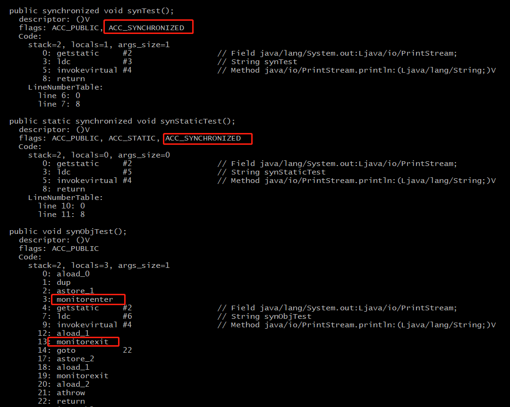

#### 为什么String是不可变类1

String a = "123"  a = "456" a 实际是一个内存地址， 底层新建了一个字符串，a换指向到新的456， 从源码层面上分析， String类，value 数组 是final 类型，并且没有set 方法设值，所以外部对象无法修改值，因此是不可变对象。反射除外。考察不可变对象的定义

#### 在调用子类构造方法之前会先调用父类没有参数的构造方法,其目的是?2

帮子类做初始化工作

#### 字符型常量和字符串常量的区别?3

- 形式上: 字符常量是单引号引起的一个字符; 字符串常量是双引号引起的若干个字符
- 含义上: 字符常量相当于一个整型值( ASCII 值),可以参加表达式运算; 字符串常量代表一个地址值(该字符串在内存中存放位置)
- 占内存大小 字符常量只占**2个**字节; 字符串常量占若干个字节(至少一个字符结束标志) (注意： **char在Java中占两个字节**)

#### int 类型 float double 的取值范围4

- int 4个字节 32位 ，高位是符号位 -2^31 ~ 2^31-1 
- float 4个字节 高位是符号位，8位指数位置，23位尾数位。
- double 8个字节，高位是符号位，11位指数位，52位尾数位。

#### 为什么说Java只有值传递5

- 值传递：是指在调用函数时将实际参数复制一份传递到函数中，这样在函数中如果对参数进行修改，将不会影响到实际参数。
- 引用传递：是指在调用函数时将实际参数的地址直接传递到函数中，那么在函数中对参数所进行的修改，将影响到实际参数。
- 一个方法参数是一个引用类型，方法内部修改此引用类型的属性。此行为解释为值传递，将此对象的地址复制一份以实参传进来，只不过你不是改变这个实参，而是去改变这个实参所指的内存地址上的内容

#### Java 序列化中如果有些字段不想进行序列化，怎么办？6

对于不想进行序列化的变量，使用 transient 关键字修饰。transient 关键字的作用是：阻止实例中那些用此关键字修饰的的变量序列化；当对象被反序列化时，被 transient 修饰的变量值不会被持久化和恢复。transient 只能修饰变量，不能修饰类和方法。

#### 为什么wait, notify 和 notifyAll这些方法不在thread类里面？7

Java中提供的锁是对象级的而不是线程级的，每个对象都有锁，锁通过线程去获取。由于wait,notify,notifyAll都是锁级别的操作，所以把他们定义在Object类中。

#### volatile 是如何保证可见性的 8

并发的三个特征：原子性，可见性，有序行。volatile 可以保证可见性与有序性。JVM在程序编译时，可能会进行指令重排序优化，在不影响单线程执行结果的前提下，尽可能的提高并行度（发挥多核优势），但是在多线程环境下，有些代码的顺序改变有可能引发逻辑上的不正确。

- 可见性：程序在执行时，都会将需要用到的值拷贝一个副本到当前核的缓存中，当运算完成后再刷新到主存中。而volatile关键词修饰的变量，在每次对变量修改后，都会引起处理器缓存（工作内存）回写到主存，而回写主存这一操作又会导致其它处理器的工作内存无效。

- 有序性：Java内存模型定义一套有序性规则，通常称为 “happens-before” 原则。如果两个操作的执行无法从这个原则中推导出来，那么虚拟机可以任意的对它们进行重排序。

  - 程序顺序规则：在同一个线程内，按照代码顺序，书写在前面的操作先发生于书写在后面的操作。
  - 锁定规则：对于锁M，解锁操作都先于随后对锁M的加锁操作。
  - volatile规则：对于一个用volatile修饰的变量，写操作要先于后面的所有读操作。
  - 传递规则：A先于B，B先于C，那么A就先于C。
  - 线程启动规则：线程Thread start方法及之前的操作都先于此线程的所有动作。
  - 线程中断规则：在A线程中调用B线程的interrupt方法，要先B线程检测到interrupt。
  - 线程终结规则：线程中的所有操作都先于线程终止检测。
  - 对象终结规则：一个对象的初始化完成（构造函数执行结束）先于finalize()方法的开始。

  使用volatile关键词修饰变量，happens-before于任意后续对该变量的读，这一原则。JVM底层是通过“内存屏障”的东西来完成。是一组处理器指令，用于实现对内存操作的顺序限制。

#### 进程，线程，协程的区别 9

- 进程：是操作系统进行资源调度的最小单位，进程有自己独立的地址空间。进程间的通信方式主要有以下8种
  - 无名管道：半双工，单向通信，亲缘线程，通常父子
  - 命名管道：也是半双工，但是允许非亲缘线程
  - 消息队列：存放在内核，由消息队列标识符标识。
  - 共享内存：映射一段能被其它进程访问的内存，一个进程创建，多个进程使用。最快
  - 信号量：是一个计数器，控制多个进程对共享资源的访问。常常作为锁机制
  - 套接字通信：ip:port
  - 信号：复杂机制，用于接收，通知进程某个事件已经发生
- 线程：是操作系统cpu调度执行的最小单位，拥有资源独立运行的最小单位。一个进程由一个或者多个线程构成，多进程比多线程健壮，一个崩了不会影响其它；线程开销大。


- 协程：是一种比线程更加轻量级，协程最大的特点是不归操作系统内核管理，而是由程序本身控制。这样带来的好处是大大提高性能。不用来回切换线程，耗费资源。不需要锁机制，因为是在同一个线程中，不存在写变量冲突，无需加锁只需判断资源状态，所以执行效率很高。

#### wait 与 sleep 区别 10

- 原理不同：wait 是Object类的方法，用于线程之间通讯，该方法会使拥有该对象的锁的进程进行等待。sleep 是线程中的方法，用来线程控制自身流程，此方法会暂停此线程一段时间，把资源让给其它线程。
- 锁的处理不同：sleep不释放锁，wait 会释放当前持有锁
- 使用区域不同：wait 方法必须在同步代码块中使用，sleep方法可以放在任何地方使用，但是需要捕获异常。

#### Java结束线程的三种方式 11

- 正常执行完结束，即run方法结束
- 调用线程的stop方法强制终止线程 不推荐，被弃用
- 调用线程的interrupt方法，中断线程

#### Java中如何控制多个线程有序执行12

- 主线程使用join多个子线程/子线程相互join，但是会阻塞主线程，每个join都会等待结果。
- 使用线程wait方法，生产者消费者。
- 使用单一队列线程池，queue，有序执行。
- 使用线程的Condition方法。通常与一个锁关联
- 使用线程的countDownLatch 设置倒计时。
- 使用CyclicBarrier(回环栅栏)实现线程按顺序运行
- 使用Sephmore(信号量)实现线程按顺序运行
- https://zhuanlan.zhihu.com/p/80787379

#### Java中synchronized关键字使用三种方式，以及底层实现原理 13

使用JDK自带的 javap 命令查看此类的相关字节码文件 javap -c -s -v -l SynchronizedDemo.class

- 修饰静态方法：作用于当前类对象加锁，进入同步代码前要获取当前类对象的锁 ACC_SYNCHRONIZED 标识。ACC_STATIC 标识为静态方法。
- 修饰实例方法：作用于当前对象的实例加锁，进入同步代码前要获取当前对象实例的锁。使用的是方法标识符 ACC_SYNCHRONIZED 标识，指明该方法是一个同步方法，JVM通过该标识进入此方法前是否获取当前实例的monitor持有权。
- 修饰代码块：指定加锁对象，对给定对象加锁，进入同步代码块前要获得指定对象的锁。查看字节码文件，看到同步语句块实现使用的是 monitorenter 与 monitorexit 指令，其中 monitorenter 指令则指明同步代码块开始位置，monitorexit 指令指明结束位置。当执行 monitorenter 指令时，线程会尝试获取monitor的持有权，monitor对象存在Java对象的对象头中，synchronized就是通过这种方式获取锁的，这也是Java中任意对象可以作为锁的原因，当monitor 锁计数器为0时标识可以获取，为1时不可获取。加锁失败那当前线程就要阻塞。

```java
package com.test.sfjava;

public class SyncTest {

    public synchronized void synTest() {
    	System.out.println("synTest");
    }

    public synchronized static void synStaticTest() {
    	System.out.println("synStaticTest");
    }

    public void synObjTest() {
        synchronized (this) {
			System.out.println("synObjTest");
        }
    }

}

```



#### JDK1.6 之后锁的底层优化 14

前世：synchronized 属于重量级锁，效率低下，因为监视器（monitor）是依赖于底层操作系统的 Mutex Lock 来实现的，Java的线程直接映射到操作系统的原生线程上。如果要挂起或者唤醒一个线程都需要操作系统帮忙完成，而操作系统在完成这一操作需要从用户态切换到内核态，这个状态转换成本较高，这也是早期synchronized 效率低下的原因。

优化：引入了优化，如偏向锁，轻量级锁，自旋锁，适应性自旋锁，锁消除，锁粗化等技术来减少锁的操作开销。

今生：1.6优化之后，synchronized 锁效率已经大大提升。

偏向锁：偏向于第一个获取它的线程，在接下来的执行中，锁没有被其他线程获取，那么持有偏向锁的线程就零成本获取锁。对于锁竞争激烈的场合，偏向锁失效，因为每次申请锁的线程都可能是不同的，这种场合不适用。加锁失败不会立即膨胀为重量级锁，而是先升级为轻量级锁。

轻量级锁：本意是在没有多线程竞争的前提下，减少传统的重量级锁使用操作系统互斥量产生的性能消耗，轻量级锁的加锁和解锁使用的是CAS操作。轻量级锁能够提升程序同步性能的依据是“对于绝大部分锁，在整个同步周期内都是不存在竞争的”，这是一个经验数据。如果没有竞争，CAS操作避免了使用互斥操作的开销。但是如果存在锁竞争，处理互斥量开销，还会额外发生CAS，因此锁竞争下，轻量级锁比传统的重量级锁更慢，这种情况会升级为重量级锁。

自旋锁与自适应锁：轻量级锁失败后，虚拟机为避免线程真实在操作系统层面挂起，还会进行一项称为自旋锁的优化手段。因为操作系统层面涉及用户态与内核态转换，阻塞耗时。一般线程持有锁的时间都不是太长，为了让线程等待，我们只需要让线程执行一个忙循环（自旋），这项技术就叫做自旋。自旋的时间一定要有限度，默认值是10次。1.6之后自适应的自旋锁不固定，根据前一次同一个锁的自旋时间以及锁的拥有者的状态来决定。

锁消除：指虚拟机编辑器在运行时，如果检测到那些共享数据不可能存在竞争，就执行锁消除。可以节省毫无意义的请求锁时间。

锁粗化：原则上在同步代码块尽量小，大部分情况没问题，但是如果一系列连续操作对同一个对象反复加锁解锁，会带来不必要的性能消耗，将锁粗化意思就是将多次锁请求合并成一个，降低短时间内的大量锁请求。同步，释放带来的性能损耗。

#### Synchronized 和 ReenTrantLock 的对比  15

- 两者都是可重入锁：自己可以再次获取自己内部的锁。
- 实现方式不同：Synchronized 依赖JVM 而 ReentrantLock 依赖于 API。Synchronized 是依赖JVM 编译形成的监视器指令实现的，并没有直接暴露给我们。ReentrantLock 是JDK层面的直接暴露出来的API，可以查看源码如何实现。
- ReentrantLock 比 synchronized 增加了一些高级功能。等待可中断，可实现公平锁，可实现选择性通知（锁可以绑定多个条件）。Synchronized 只能是非公平锁。
- 性能已不是选择标准：1.6之前 Synchronized 性能很差，1.6之后两者持平了。而且虚拟机在未来的性能改进中会更偏向于原生的synchronized，优化后的synchronized 在很多地方也使用了CAS操作，而虚拟机底层优化的上限可以更高。

#### 死锁与活锁的区别，死锁与饥饿的区别？16

死锁：只两个或以上的线程（进程）在执行过程中，因争夺资源而造成的一种相互等待的现象，若无外力作用，谁也无法继续推进下去。以下是死锁的四个条件，破坏其中任意一个就可打破死锁

- 互斥条件：线程对资源访问具有排他性，同时刻只能一个线程占用某资源。
- 请求保持条件：线程A保持了一个资源a的占用，但又提出了b资源请求，而此时资源b被其它线程B占用，于是该线程A必须等待，但又对自己占用的资源a不释放。
- 不可剥夺条件：线程已获得的资源是不可被剥夺的，只有自己释放。
- 环路等待条件：死锁发生时，必然存在一个“进程-资源环形链”

活锁：任务或执行者没有被阻塞，只是由于某些条件还未满足，一直重复尝试。与死锁的区别在于活锁的实体状态是在不断改变的，存在可能被解除。死锁是一直处于等待状态，并且不可被解除

饥饿：指线程获取不到相应的资源，长时间无法执行线程任务。例如低优先级线程，wait 调用。

阻塞队列的原理 ：实现两个附加操作的队列。1队列为空时，获取元素线程会等待队列非空。2队列满时，添加元素线程会等待队列可用。

#### 谈谈gRPC底层原理 17

gRPC是一款高性能，开源的，将移动和HTTP/2放在首位的RPC框架。其构建是基于HTTP/2的，因此具备很多HTTP/2的新特性，例如，多路复用，首部压缩，服务端推送等特性，基于这些特性，可以让应用在移动端更省电和省空间，从而加速服务。当然gRPC也具备RPC框架的常规组成部分，服务端，客户端，消息格式，序列化协议，通讯协议。特别值得一提的是gPRC 使用protobuf 作为接口定义语言，gRPC利用protobuf 插件编译成相应的客户端和服务端，正是这点是的gRPC具有跨语言的特性。

#### 谈谈etcd底层原理18

etcd是一个分布式，一致性的kv存储组件，主要用于共享配置与服务发现。提供了一系列的数据存储与数据获取接口，数据watch机制，key过期与续约机制等。

- 如何保证数据的一致性：基于raft算法实现。
  - leader选举：在raft算法中定义所有节点都只有三种状态，leader，follower，candidate 。所有节点一开始都默认是follower状态，如果follower没有收到leader的心跳包（follower时刻都在超时倒计时），则会转化为candidate状态，给自己发起leader投票，并且请求其它节点为自己投票，一旦获得集群大多数节点的投票则成为leader。
  - 日志复制：所有的数据修改都只经过leader节点，并且记录日志。此时leader节点修改的数据是未提交状态。接着leader会将修改操作通知到follower节点，等到大多数follower记录日志成功，此时leader将本次修改正式提交，返回客户端成功，并且通知follower也进行提交。
  - 重新选举：在raft协议中，是通过两种超时来控制选举过程。第一种是选举超时，默认是150ms-300ms，在这个时间段未收到leader心跳包，则将自己变为candidate，开始新的选举，给自己投票，并且发送请求其它节点给自己投票。其它节点会判断任期比自己大的并且日志在自己之后的投票成功。获取大多数节点投票则晋升为leader。接着leader会发送append entry message 给follower，将日志补齐，方式是通过心跳包传输，时间间隔是heartbeat timeout。如果出现多个节点收到的投票数相同，则只有等待，选举超时（时间也是随机），重新发起投票了。

#### http与https的区别19

http属于计算机网络模型中应用层协议，超文本传输协议，被广泛应用于web服务及网站之间信息传递。但是在进行数据交换时，是明文传输，存在数据泄密，数据被篡改的风险，而https的出现就是为了解决这一问题。在http的基础上加上安全套接字ssl协议就构成了https，ssl来验证服务器的身份，并为通信报文进行加密传输。

- https需要到ca申请证书，免费证书几乎没有，需要付费。
- http与https是完全不同的连接方式，使用的端口号也不一样，http默认是80，https默认是443
- https在http的基础上，加入ssl，可以从两方面让通讯更加安全，第一确认对方身份合法性，第二数据密文传输。

https四次握手过程

1. 客户端向服务端发起请求，带上信息，生成随机数 client random，加密套件列表，版本号，压缩算法等。
2. 服务端返回，协商后的版本号，加密套件，压缩算法，以及证书（公钥，证书过期时间，颁发机构），生成随机数 server random
3. 客户端，TSL模块验证公钥是否合法，即颁发机构是否可靠，证书是否过期。如果验证未通过则会弹出警告提示框确认风险信任。然后客户端生成一个随机数Premaster secret，通过证书加密发送给客户端。
4. 服务端，通过证书的私钥进行解密得到第三个随机数，通过之前约定的加密算法，使用这三个随机数生成会话通信对称秘钥 session key。
5. 使用这个session key来进行会话通信。此时客户端和服务端分别都能得到这三个随机数，所以双方都知道这个对称加密的秘钥。另外如果存在中间人劫持，只能得到 client random 和 server random ，第三个随机数无法获取，除非能破解第三个随机数，一般非对称加密比较复杂，破解困难。

#### 说一下BIO NIO AIO 20

IO 有同步和异步，阻塞与非阻塞之说

同步和异步：同步是一个任务的执行依赖于另外一个任务，只有等被依赖任务执行完成后，依赖任务才算执行成功，可靠序列，要么都成功要么都失败。异步表示不需要等待被依赖的任务完成，只需通知依赖的任务需要完成什么，依赖任务就可以立即启动，只要自己完成了，就算完成了，不可靠序列。当一个同步调用发生，需要等待这个调用结束，才能执行后续操作。异步调用发生时，不能立即得到调用结果。实际处理这个调用的部件，在完成任务后通过状态，通知，或者回调来通知调用者。

阻塞与非阻塞：非阻塞在不能立即得到结果之前，该函数不会阻塞当前线程，而会立即返回。虽然表面上CPU利用率高，实际上带来额外的线程切换的开销，增加的CPU的执行时间能否补偿系统切换的开销需要评估。

- BIO 同步阻塞IO：效率最低。银行办业务，人排队，什么也不做，专心排队。
- NIO 同步非阻塞IO：效率低下。一边排队，一边打电话，打电话的时候，要时不时抬头看，队伍是否排到了。来回切换状态。
- AIO 异步非阻塞IO：效率高。打电话是自己的事情，通知是柜台的事情。首先取个号，然后就去打电话了，等号到了，柜台通知你（回调函数）。