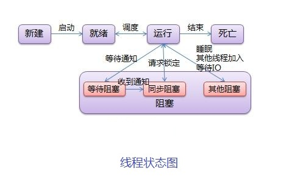

#### 为什么String是不可变类1

String a = "123"  a = "456" a 实际是一个内存地址， 底层新建了一个字符串，a换指向到新的456， 从源码层面上分析， String类，value 数组 是final 类型，并且没有set 方法区设值，所以外部对象无法修改值，因此是不可变对象。反射除外。考察不可变对象的定义

#### 在调用子类构造方法之前会先调用父类没有参数的构造方法,其目的是?2

帮子类做初始化工作

#### 字符型常量和字符串常量的区别?3

- 形式上: 字符常量是单引号引起的一个字符; 字符串常量是双引号引起的若干个字符
- 含义上: 字符常量相当于一个整型值( ASCII 值),可以参加表达式运算; 字符串常量代表一个地址值(该字符串在内存中存放位置)
- 占内存大小 字符常量只占**2个**字节; 字符串常量占若干个字节(至少一个字符结束标志) (注意： **char在Java中占两个字节**)

#### int 类型 float double 的取值范围4

- int 4个字节 32位 ，高位是符号位 -2^31 ~ 2^31-1 
- float 4个字节 高位是符号位，8位指数位置，23位尾数位。
- double 8个字节，高位是符号位，11位指数位，52位尾数位。

#### 为什么说Java只有值传递5

- 值传递：是指在调用函数时将实际参数复制一份传递到函数中，这样在函数中如果对参数进行修改，将不会影响到实际参数。
- 引用传递：是指在调用函数时将实际参数的地址直接传递到函数中，那么在函数中对参数所进行的修改，将影响到实际参数。
- 一个方法参数是一个引用类型，方法内部修改此引用类型的属性。此行为解释为值传递，将此对象的地址复制一份以实参传进来，只不过你不是改变这个实参，而是去改变这个实参所指的内存地址上的内容

#### Java 序列化中如果有些字段不想进行序列化，怎么办？6

对于不想进行序列化的变量，使用 transient 关键字修饰。transient 关键字的作用是：阻止实例中那些用此关键字修饰的的变量序列化；当对象被反序列化时，被 transient 修饰的变量值不会被持久化和恢复。transient 只能修饰变量，不能修饰类和方法。

#### 为什么wait, notify 和 notifyAll这些方法不在thread类里面？7

Java中提供的锁是对象级的而不是线程级的，每个对象都有锁，锁通过线程去获取。由于wait,notify,notifyAll都是锁级别的操作，所以把他们定义在Object类中。

#### volatile 是如何保证可见性的 8

并发的三个特征：原子性，可见性，有序行。volatile 可以保证可见性与有序性。JVM在程序编译时，可能会进行指令重排序优化，在不影响单线程执行结果的前提下，尽可能的提高并行度（发挥多核优势），但是在多线程环境下，有些代码的顺序改变有可能引发逻辑上的不正确。

- 可见性：程序在执行时，都会将需要用到的值拷贝一个副本到当前核的缓存中，当运算完成后再刷新到主存中。而volatile关键词修饰的变量，在每次对变量修改后，都会引起处理器缓存（工作内存）回写到主存，而回写主存这一操作又会导致其它处理器的工作内存无效。

- 有序性：Java内存模型定义一套有序性规则，通常称为 “happens-before” 原则。如果两个操作的执行无法从这个原则中推导出来，那么虚拟机可以任意的对它们进行重排序。

  - 程序顺序规则：在同一个线程内，按照代码顺序，书写在前面的操作先发生于书写在后面的操作。
  - 锁定规则：对于锁M，解锁之前的所有操作都先于锁M的加锁之后的所有操作。
  - volatile规则：对于一个用volatile修饰的变量，写操作要先于后面的所有读操作。
  - 传递规则：A先于B，B先于C，那么A就先于C。
  - 线程启动规则：线程Thread start方法及之前的操作都先于此线程的所有动作。
  - 线程中断规则：在A线程中调用B线程的interrupt方法，要先B线程检测到interrupt。
  - 线程终结规则：线程中的所有操作都先于线程终止检测。
  - 对象终结规则：一个对象的初始化完成（构造函数执行结束）先于finalize()方法的开始。

  使用volatile关键词修饰变量，happens-before于任意后续对该变量的读，这一原则。JVM底层是通过“内存屏障”的东西来完成。是一组处理器指令，用于实现对内存操作的顺序限制。

#### 进程，线程，协程的区别 9

- 进程：是操作系统进行资源调度的最小单位，进程有自己独立的地址空间。进程间的通信方式主要有以下8种
  - 无名管道：半双工，单向通信，亲缘线程，通常父子
  - 命名管道：也是半双工，但是允许非亲缘线程
  - 消息队列：存放在内核，由消息队列标识符标识。
  - 共享内存：映射一段能被其它进程访问的内存，一个进程创建，多个进程使用。最快
  - 信号量：是一个计数器，控制多个进程对共享资源的访问。常常作为锁机制
  - 套接字通信：ip:port
  - 信号：复杂机制，用于接收，通知进程某个事件已经发生
- 线程：是操作系统cpu调度执行的最小单位，拥有资源独立运行的最小单位。一个进程由一个或者多个线程构成，多进程比多线程健壮，一个崩了不会影响其它；线程开销大。

- 协程：是一种比线程更加轻量级，协程最大的特点是不归操作系统内核管理，而是由程序本身控制。这样带来的好处是大大提高性能。不用来回切换线程，耗费资源。不需要锁机制，因为是在同一个线程中，不存在写变量冲突，无需加锁只需判断资源状态，所以执行效率很高。

#### wait 与 sleep 区别 10

- 原理不同：wait 是Object类的方法，用于线程之间通讯，该方法会使拥有该对象的锁的进程进行等待。sleep 是线程中的方法，用来线程控制自身流程，此方法会暂停此线程一段时间，把资源让给其它线程。
- 锁的处理不同：sleep不释放锁，wait 会释放当前持有锁
- 使用区域不同：wait 方法必须在同步代码块中使用，sleep方法可以放在任何地方使用，但是需要捕获异常。

#### Java结束线程的三种方式 11

- 正常执行完结束，即run方法结束
- 调用线程的stop方法强制终止线程 不推荐，被弃用
- 调用线程的interrupt方法，中断线程

#### Java中如何控制多个线程有序执行12

- 主线程是用join多个子线程/子线程相互join，但是会阻塞主线程，每个join都会等待结果。
- 使用线程wait方法，生产者消费者。
- 使用单一队列线程池，queue，有序执行。
- 使用线程的Condition方法。通常与一个锁关联
- 使用线程的countDownLatch 设置倒计时。
- 使用CyclicBarrier(回环栅栏)实现线程按顺序运行
- 使用Sephmore(信号量)实现线程按顺序运行
- https://zhuanlan.zhihu.com/p/80787379